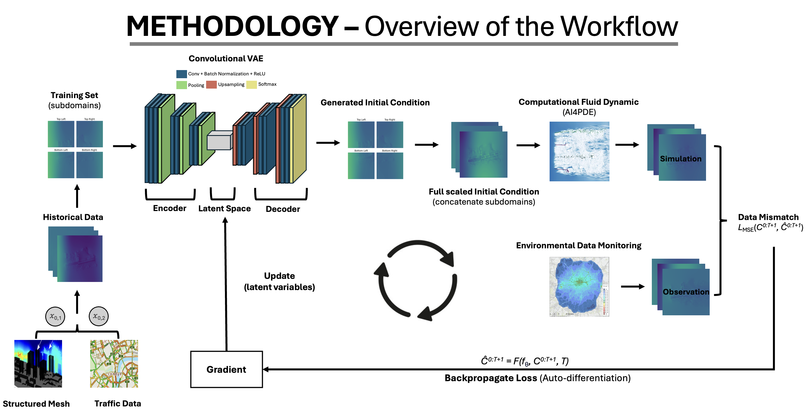
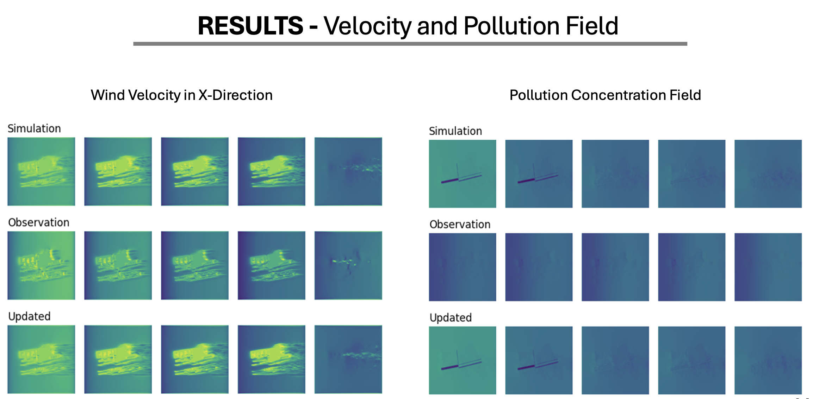
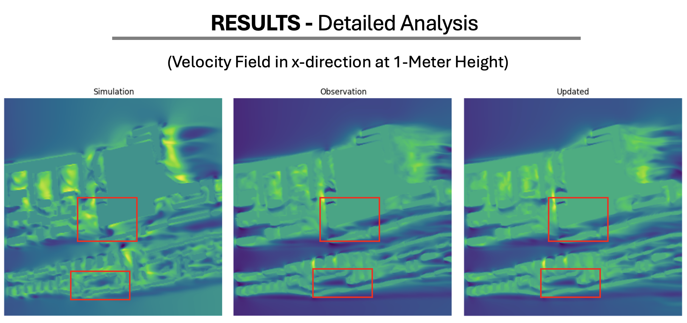

# Independent Research Project - Hanson (Hung-Hsuan) Shen

## Overview
This project aims to develop a comprehensive system to predict pollution dispersion and wind velocity field using advanced machine learning techniques, including Convolutional VAE, Computational Fluid Dynamic, and Data Assimilation (DA). The system leverages historical data and observational imagery to enhance prediction accuracy and provide actionable insights.




## Data Description
- `Urban_street.npy`: Data of detailed layout to generate structured mesh in Du Cane Road
- `INHALE_1280.npy`: Data of detailed layout to generate structured mesh in South Kensington
- `final_combined_data.npy`: Processed velocity data needed for CVAE and further simulations
- `final_combined_data_p.npy`: Processed pollution data needed for CVAE and further simulations

## Getting Started

To run the code in this repository, please follow the steps below. 

1. Clone this repository: 

   ```bash
   git clone https://github.com/ese-msc-2023/irp-hs1623.git
   cd the-directory-name-where-the-repo-is
   ```

2. Unzip the necessary files: 
   - `Data Collection`: `Urban_street.npy.zip`, `INHALE_1280.npy.zip`
   - `Data Preprocessing`: `final_combined_data.npy.zip`, `final_combined_data_p.npy.zip`
  
3. Extract the downloaded files to directory

   ```bash
   ./Data
   ```

4. Create and Activate a Virtual Environment

   ```bash
   conda create --name irp python=3.10
   conda activate irp
   ```

5. Install Your Project

   With your virtual environment activated, install your project and its dependencies using the `setup.py` file: 

   ```bash
   pip install .
   ```

## Repository Structure

- **Data Collection**
  - `AI4Urban.py`: Contains computational fluid dynamic model
  - `Raw dataset`: INHALE_1280.npy and Urban_street.npy

- **Data Preprocessing**
  - `Du Cane Road`: Contains processed dataset and trained Convolutional VAE models
  - `South Kensington`: Contains processed dataset and trained Convolutional VAE models
   
- **Models** 
  - `CFD.py`: Contains the CFD models used for simulations
  - `CVAE.py`: Contains the convolutional VAE structure
  - `DA.py`: Contains data assimilation process
  - `utils.py`: Contains helper functions needed by other files
  - `DA_CFD_CVAE.py`: Contains a comprehensive system that include DA, CFD, and CVAE models
  
- **Notebooks** 
  - `IRP.ipynb`: Jupyter notebook for training and testing CVAE models.
  - `notebook.utils.py`: Contains helper functions needed by other files
  
- **Output**
  - `velocity`:  Directory containing updated CVAE models and data for future iterations
  - `pollution`: Directory containing updated CVAE models and data for future iterations

- **Packages**
  - `setup.py`: Setup script for installing the project as a package.
  - `requirements.txt`: List all dependencies that need to be installed using pip to ensure the project runs correctly.

- **License**
  - `LICENSE`: The license file that specifies the permissions, limitations, and conditions under which the software can be used.
  
